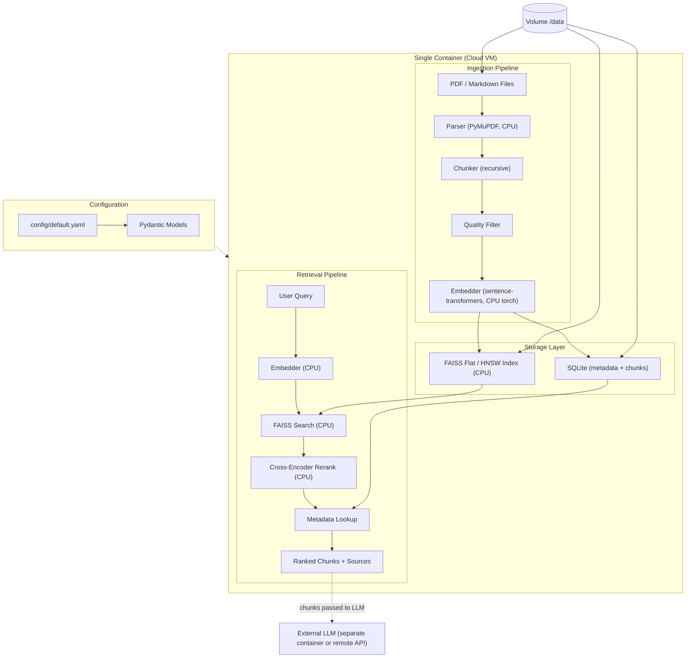
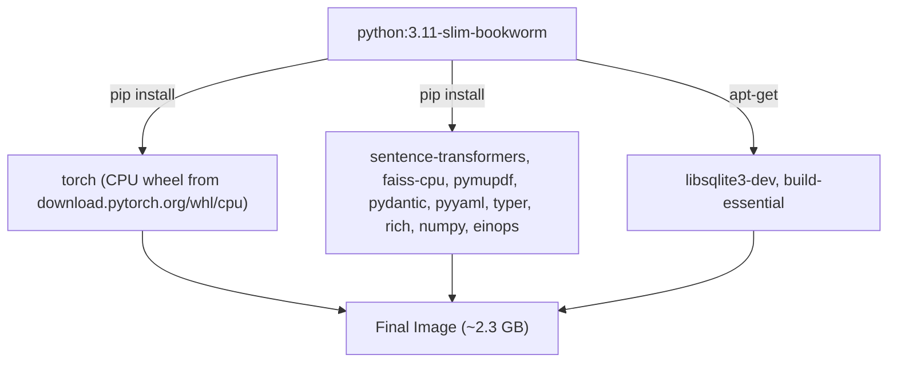

# rag-system (CPU-only)

CPU-only document ingestion and retrieval system, designed to run in a modest cloud VM with no GPU required. This is the `cpu-only` branch; the `main` branch targets NVIDIA DGX Spark with cuVS / CuPy.

Handles **ingestion** (parse, chunk, quality-filter, embed, index) and **retrieval** (embed query, search, rerank, return ranked chunks with metadata). LLM generation is out of scope -- the output is a set of chunks + scores + source metadata that can be passed to any LLM (vLLM, Ollama, OpenAI, Anthropic, etc.).

---

# How to use it

## Requirements

| Spec | Minimum | Recommended |
|---|---|---|
| CPU | 4 vCPU | 8 vCPU |
| RAM | 8 GB | 16 GB |
| Disk | 20 GB | 50 GB (NVMe) |
| Host | Docker (no NVIDIA toolkit needed) | Docker |

Works on x86_64 and arm64. No CUDA drivers, no `--gpus` flag.

## Quickstart (Docker)

```bash
# 1. Build (~2.3 GB image; first build downloads models, ~5 min)
docker build -t rag-system-cpu .

# 2. Place documents in ./data/docs/ (PDF or Markdown)
mkdir -p ./data/docs
cp your_docs/*.pdf ./data/docs/

# 3. Ingest
docker run --rm \
  -v "$(pwd)/data:/data" \
  -v "$(pwd)/config:/app/config" \
  rag-system-cpu ingest /data/docs

# 4. Retrieve
docker run --rm \
  -v "$(pwd)/data:/data" \
  -v "$(pwd)/config:/app/config" \
  rag-system-cpu retrieve "What is the main finding?"

# 5. Launch the chunk viewer UI on http://localhost:8501
docker run --rm -p 8501:8501 \
  -v "$(pwd)/data:/data" \
  -v "$(pwd)/config:/app/config" \
  rag-system-cpu view
```

## Local (non-Docker) install

```bash
python3.11 -m venv .venv
source .venv/bin/activate

pip install --index-url https://download.pytorch.org/whl/cpu torch
pip install -e .

python cli.py ingest ./data/docs
python cli.py retrieve "your query here"
python cli.py view
```

Note: [config/default.yaml](config/default.yaml) defaults to `/data/...` paths (the container volume). For local runs either mount a `./data` symlink to `/data` or edit `retriever.index_path` and `retriever.metadata_db` to point somewhere writable.

## Configuration

All behavior is driven by [config/default.yaml](config/default.yaml), validated by Pydantic models in [src/config.py](src/config.py). Override by pointing the CLI at a different file:

```bash
python cli.py --config my_config.yaml ingest ./docs
```

### Key knobs

| Setting | Default | Notes |
|---|---|---|
| `embedder.model` | `nomic-ai/nomic-embed-text-v1.5` | Swap to `BAAI/bge-small-en-v1.5` for ~5x faster CPU encoding |
| `embedder.batch_size` | `32` | Lower if RAM is tight |
| `embedder.dimensions` | `768` | Matryoshka truncation supported |
| `retriever.backend` | `faiss` | `faiss` (default) or `numpy` (no extra deps) |
| `retriever.algorithm` | `flat` | `flat` for exact search, `hnsw` for >500k vectors |
| `reranker.enabled` | `true` | Disable for lower latency |
| `chunker.chunk_size` | `2048` | Characters per chunk |

## Using an OpenAI-compatible embeddings API

Set `embedder.provider: openai` in the config and provide env vars:

```bash
cp .env.example .env
# edit .env with your OPENAI_API_KEY and optional OPENAI_API_BASE

docker run --rm --env-file .env \
  -v "$(pwd)/data:/data" -v "$(pwd)/config:/app/config" \
  rag-system-cpu ingest /data/docs
```

This removes the CPU embedding load entirely; useful for very large ingests against a hosted endpoint (OpenAI, Together, a local vLLM embedding server, etc.).

## CLI

```
python cli.py --help

Commands:
  ingest    Parse, chunk, embed, and index documents.
  retrieve  Retrieve relevant chunks for a query.
  view      Launch the chunk viewer web UI with semantic search.

Options:
  -c, --config PATH    Path to YAML config (default: config/default.yaml)
  -v, --verbose        Enable debug logging
```

```
python cli.py retrieve --help

Arguments:
  QUERY                Search query (required)

Options:
  -k, --top-k INTEGER  Number of results (overrides config)
```

## Measured performance

Numbers below are from a real end-to-end benchmark on **NVIDIA DGX Spark running this CPU-only branch** (20-core ARM Grace Blackwell, 128 GB LPDDR5x -- but only CPU is used; no GPU, no cuVS, no CUDA). Averaged over 3 fresh runs.

**Corpus:** 7 files, ~4 MB total (3 PDFs, 4 Markdown) -> 259 chunks (2048 chars each) after recursive chunking + quality filter.
**Embedder:** `nomic-ai/nomic-embed-text-v1.5` (137M params, 768-dim), CPU torch.
**Retriever:** `faiss-cpu` IndexFlatIP (cosine).
**Reranker:** `cross-encoder/ms-marco-MiniLM-L-6-v2`.

### Ingest pipeline (avg of 3 runs)

| Phase | Time | % |
|---|---|---|
| `collect` (file discovery) | 0.000s | 0.0% |
| `parse` (PyMuPDF + Markdown) | 0.185s | 0.3% |
| `chunk` (recursive splitter) | 0.005s | 0.0% |
| `filter` (quality filter) | 0.053s | 0.1% |
| `embed` (sentence-transformers, CPU) | 73.02s | 99.6% |
| `index_add` (FAISS append) | 0.022s | 0.0% |
| `index_build` (FAISS flat build) | 0.001s | 0.0% |
| `index_save` (disk write) | 0.001s | 0.0% |
| **Total** | **~73.3s** | |

Effective embedding throughput: **~3.5 chunks/s** (~7k characters/s). CPU inference on a 137M-param model is essentially the entire cost; everything else is noise.

### Retrieve pipeline (cold container, top-3 with rerank)

| Phase | Time |
|---|---|
| `load` (read `faiss.index` + `vectors.npy`) | 0.003s |
| `index_build` (no-op when already loaded) | 0.000s |
| `embed_query` (single-query CPU encode, includes model load) | 3.03s |
| `search` (FAISS flat, 259 vectors) | 0.001s |
| `rerank` (cross-encoder on top-12 candidates) | 3.00s |
| **Total** | **~6.1s** |

`embed_query` and `rerank` both include the first-call model-load cost in a fresh container (~2.5-3 s each for nomic + MiniLM). In-process warm latencies (second+ calls within the same Python process) drop to roughly:

| Phase | Warm latency |
|---|---|
| `embed_query` | 50-150 ms |
| `rerank` (12 candidates) | 200-500 ms |
| `search` (IndexFlatIP, up to ~500k vectors) | < 50 ms |

For corpora beyond ~500k vectors, switch to `retriever.algorithm: hnsw` to keep search latency bounded.

### Notes on interpreting these numbers

- **Bottleneck is always embedding on CPU.** Swapping to `BAAI/bge-small-en-v1.5` (33M params, 384-dim) yields roughly 5x faster ingest on the same hardware with minor retrieval-quality trade-off.
- **Retrieval latency seen by end users** depends entirely on whether the process is kept alive (CLI daemon / the `view` subcommand / a long-running API server). Cold-container `docker run ... retrieve` will always pay the model-load tax.
- Results will scale roughly linearly on a generic x86 cloud VM with comparable CPU count; the ARM Neoverse cores on DGX Spark are broadly similar per-core to modern x86 vCPUs for sentence-transformers workloads.

---

# How it's built

## Architecture overview



## Component selection

### Document parsing -- PyMuPDF

[PyMuPDF](https://pymupdf.readthedocs.io/) (fitz) for fast CPU text extraction from PDFs. Markdown files parsed natively.

### Embeddings -- sentence-transformers (CPU torch)

[sentence-transformers](https://github.com/huggingface/sentence-transformers) on top of CPU PyTorch. 15,000+ pre-trained models on HuggingFace. The container installs the official `torch` wheel from `https://download.pytorch.org/whl/cpu`, which has no CUDA runtime.

### Embedding model tradeoffs

The default is `nomic-ai/nomic-embed-text-v1.5` -- same model as the GPU branch, so retrieval quality is unchanged. On CPU, smaller / lower-dim models are significantly faster if quality can be traded off:

| Model | Params | Dims | MTEB | License | CPU notes |
|---|---|---|---|---|---|
| all-MiniLM-L6-v2 | 22M | 384 | 56.3 | Apache 2.0 | Fastest, lowest quality |
| bge-small-en-v1.5 | 33M | 384 | 62.2 | MIT | Great speed/quality tradeoff |
| nomic-embed-text-v1.5 | 137M | 768 | ~62 | Apache 2.0 | **Default.** 8k context, Matryoshka |
| bge-base-en-v1.5 | 109M | 768 | 63.6 | MIT | Comparable to nomic |

Swap by editing `embedder.model` in [config/default.yaml](config/default.yaml); no code changes needed.

### Vector search -- FAISS (CPU)

[FAISS](https://github.com/facebookresearch/faiss) (Meta) via `faiss-cpu`. Runs in-process, no separate server. Two backends are available:

| `retriever.backend` | `retriever.algorithm` | FAISS index | When to use |
|---|---|---|---|
| `faiss` (default) | `flat` | `IndexFlatIP` / `IndexFlatL2` | Exact search, works great up to ~500k vectors |
| `faiss` | `hnsw` | `IndexHNSWFlat` | Approximate but fast for millions of vectors |
| `numpy` | (ignored) | (none, brute force) | Minimal fallback, no FAISS dep, tiny corpora |


### Reranker -- Cross-Encoder (CPU)

[cross-encoder/ms-marco-MiniLM-L-6-v2](https://huggingface.co/cross-encoder/ms-marco-MiniLM-L-6-v2) (22M params) runs on CPU torch. Applied only to a small candidate set (top 20-40 from FAISS) so total rerank latency stays under ~500 ms on warm processes.

### Config management -- YAML + Pydantic

All behavior (model names, chunk sizes, retriever backend, retrieval params) lives in YAML config validated by Pydantic models. Zero code changes needed to switch models or parameters.

## Container image strategy



Why `python:3.11-slim-bookworm`:
- Tiny base (~150 MB) vs multi-GB NGC PyTorch.
- No CUDA libraries shipped, so the final image is cloud-VM-sized (2.3 GB vs ~20 GB for the GPU branch).
- Works on both x86_64 and arm64 hosts without modification.

## Storage layout

Per-ingest artifacts live under `retriever.index_path` + `retriever.metadata_db` (defaults `/data/indexes` and `/data/metadata.db`):

| File | Content | Portable to GPU branch? |
|---|---|---|
| `metadata.db` | SQLite: chunk text, source path, metadata JSON | Yes |
| `vectors.npy` | float32 `(n, dim)` embedding matrix | Yes |
| `id_map.npy` | int64 array mapping row-index -> chunk id | Yes |
| `faiss.index` | FAISS serialized index | CPU-branch only (rebuilt from `vectors.npy` on load if missing) |
| `cagra.index` | cuVS CAGRA binary | GPU-branch only (ignored on CPU) |

Because the raw artifacts (`metadata.db`, `vectors.npy`, `id_map.npy`) are shared between branches, you can copy `/data` from a GPU-branch machine to a CPU VM and start serving immediately -- no re-embedding required. The first `retrieve` call will rebuild `faiss.index` in memory and `save()` will persist it.

## Project layout

```
rag_system/
|-- cli.py                        # Typer CLI entry point
|-- Dockerfile                    # python:3.11-slim + CPU torch + faiss-cpu
|-- pyproject.toml
|-- README.md                     # This document
|-- config/
|   `-- default.yaml              # All pipeline settings
|-- src/
|   |-- config.py                 # Pydantic config models
|   |-- pipeline.py               # Orchestrates ingest + retrieve (phase timers live here)
|   |-- viewer.py                 # Chunk viewer / semantic search UI
|   |-- parsers/
|   |   |-- pdf_parser.py         # PyMuPDF
|   |   `-- markdown_parser.py
|   |-- chunkers/
|   |   |-- recursive.py
|   |   `-- quality_filter.py
|   |-- embedders/
|   |   |-- local.py              # sentence-transformers (CPU)
|   |   `-- api.py                # OpenAI-compatible API
|   |-- rerankers/
|   |   `-- cross_encoder.py      # CPU cross-encoder
|   `-- retrievers/
|       |-- faiss_retriever.py    # faiss-cpu IndexFlatIP / HNSW (default)
|       |-- numpy_retriever.py    # Brute-force fallback
|       `-- metadata_store.py     # SQLite metadata/chunk store
`-- .env.example                  # Env template (only needed for OpenAI embedder)
```

## Branch relationship

| Branch | Target | Vector search | Embedder device | Image |
|---|---|---|---|---|
| `main` | NVIDIA DGX Spark | cuVS CAGRA (GPU) | CUDA | NGC PyTorch (~20 GB) |
| `cpu-only` (this) | Generic cloud VM | faiss-cpu / NumPy | CPU | python:3.11-slim (~2.3 GB) |

The branches share the same CLI, config schema (minus GPU-only options), SQLite schema, and on-disk embedding format (`vectors.npy` + `id_map.npy`).

## License

See the parent project; no separate license for this branch.
