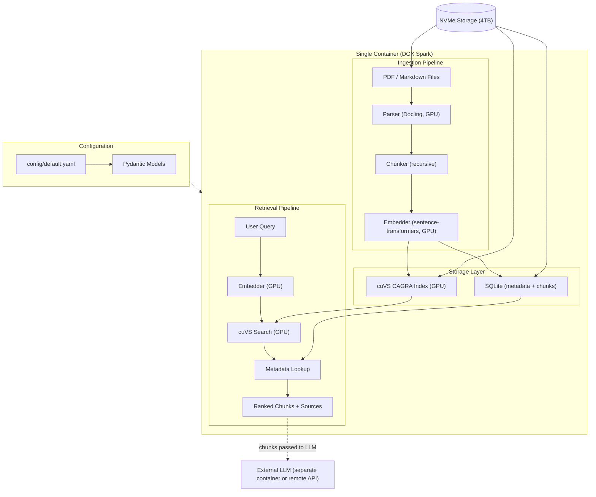
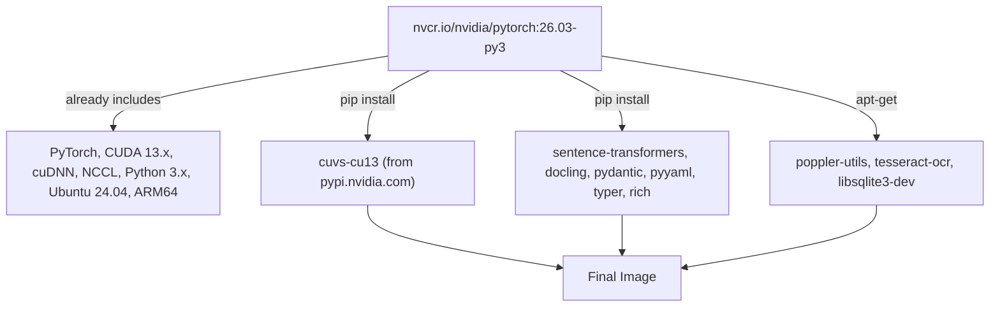

# RAG System Architecture

A GPU-accelerated document ingestion and retrieval system targeting NVIDIA DGX Spark.

## Scope

This system handles **document ingestion** (parse, chunk, embed, index) and **retrieval** (embed query, search, return ranked chunks with metadata). LLM generation is explicitly **out of scope** -- it happens in a separate container (e.g. vLLM, Ollama) or via remote API calls. This system's output is a set of retrieved chunks with scores and source metadata, ready to be passed to any LLM.

## Target Platform: NVIDIA DGX Spark

The system runs exclusively inside a single container on DGX Spark:

| Spec | Detail |
|------|--------|
| **SoC** | NVIDIA GB10 Grace Blackwell Superchip |
| **GPU** | Blackwell architecture (sm_121), up to 1 PFLOP FP4 |
| **CPU** | 20-core ARM (aarch64) -- 10x Cortex-X925 + 10x Cortex-A725 |
| **Memory** | 128 GB LPDDR5x unified memory (shared CPU/GPU, 273 GB/s) |
| **Storage** | 4 TB NVMe |
| **CUDA** | 13.x |
| **Container** | NVIDIA Container Runtime for Docker (pre-installed) |

The unified memory architecture means there is no PCIe bottleneck between CPU and GPU -- data lives in one address space. This makes in-process GPU libraries (cuVS, sentence-transformers) especially efficient since there is no device-to-host copy overhead.

## Architecture Overview



## Component Selection

### Document Parsing -- Docling

[Docling](https://github.com/docling-project/docling) (IBM Research). GPU-accelerated (up to 6x speedup on Blackwell). Outputs structured Markdown/JSON from PDFs. Handles tables, images, OCR. Markdown files parsed natively. Configurable batch sizes for OCR and layout detection.

### Embeddings -- sentence-transformers

[sentence-transformers](https://github.com/huggingface/sentence-transformers) (v5.3). 15,000+ pre-trained models on HuggingFace, full CUDA support. The NGC PyTorch base image already includes PyTorch with CUDA -- sentence-transformers layers directly on top. Also supports OpenAI-compatible embeddings API as a config option.

### Embedding Model Tradeoffs

With 128 GB unified memory on DGX Spark, even the largest open models fit comfortably. The key tradeoffs are **retrieval quality vs. latency vs. licensing**:

| Model | Params | Dims | MTEB | Context | License | Memory | Notes |
|-------|--------|------|------|---------|---------|--------|-------|
| all-MiniLM-L6-v2 | 22M | 384 | 56.3 | 512 | Apache 2.0 | <1 GB | Legacy baseline, very fast, low quality |
| nomic-embed-text-v1.5 | 137M | 768 | ~62 | 8192 | Apache 2.0 | ~1 GB | **Recommended default.** Matryoshka support |
| BGE-M3 (BAAI) | 568M | 1024 | 63.0 | 8192 | MIT | ~2 GB | Multilingual, hybrid retrieval |
| snowflake-arctic-embed-l | 335M | 1024 | 64.2 | 512 | Apache 2.0 | ~1.5 GB | Retrieval-focused, shorter context |
| Qwen3-Embedding-0.6B | 600M | flex | ~65 | 32K | Apache 2.0 | ~2 GB | Instruction-aware, long context |
| NV-Embed-v2 | 7.8B | 4096 | 72.3 | 32K | CC-BY-NC-4.0 | ~16 GB | Best retrieval, **non-commercial** |
| Qwen3-Embedding-8B | 8B | 7168 | 70.6 | 32K | Apache 2.0 | ~16 GB | Top permissive-license option |

**Recommended default**: `nomic-embed-text-v1.5` -- best balance of quality, speed, memory, long context, and permissive license. Upgrade path to Qwen3-Embedding-0.6B or 8B via config change.

### Vector Search -- cuVS (RAPIDS)

[cuVS](https://github.com/rapidsai/cuvs) (NVIDIA RAPIDS). GPU-accelerated vector search library. Runs in-process (no separate server), ideal for single-container DGX Spark deployment.

Advantages over a separate vector DB (Qdrant/Milvus):
- **Full GPU acceleration**: Builds indexes up to 12x faster, search latency up to 8x lower at 95% recall
- **No extra container/process**: Everything runs in one container, sharing unified memory
- **Algorithms**: CAGRA (graph-based, best quality/speed), IVF-PQ (memory-efficient for large collections), IVF-Flat, brute-force
- **Persistence**: Indexes serialize to disk via `cagra.save()` / `cagra.load()`

Since cuVS is a pure search library (no metadata filtering, no document storage), it is paired with SQLite for chunk metadata and source tracking:


### Config Management -- YAML + Pydantic

All behavior (model names, chunk sizes, index algorithm, retrieval params) lives in YAML config validated by Pydantic models. Zero code changes needed to switch models or parameters.

## Container Image Strategy



Why `nvcr.io/nvidia/pytorch:26.03-py3`:
- Ships with PyTorch + CUDA 13.x pre-built and optimized for NVIDIA hardware (including ARM64/aarch64)
- Eliminates the most fragile part of the build: matching PyTorch wheels to CUDA/cuDNN versions
- sentence-transformers and Docling both depend on PyTorch, so this gets them running immediately
- cuVS installs cleanly via `pip install cuvs-cu13 --extra-index-url=https://pypi.nvidia.com` on top

## Project Structure

```
rag_system/
├── ARCHITECTURE.md               # This document
├── config/
│   └── default.yaml              # All pipeline settings
├── src/
│   ├── __init__.py
│   ├── config.py                 # Pydantic config models
│   ├── parsers/
│   │   ├── __init__.py
│   │   ├── base.py               # Abstract parser interface
│   │   ├── pdf_parser.py         # Docling GPU-accelerated
│   │   └── markdown_parser.py    # Native markdown parsing
│   ├── chunkers/
│   │   ├── __init__.py
│   │   ├── base.py
│   │   └── recursive.py          # Recursive text splitter
│   ├── embedders/
│   │   ├── __init__.py
│   │   ├── base.py
│   │   ├── local.py              # sentence-transformers (GPU)
│   │   └── api.py                # OpenAI-compatible API
│   ├── retrievers/
│   │   ├── __init__.py
│   │   ├── base.py
│   │   ├── cuvs_retriever.py     # cuVS CAGRA/IVF-PQ + SQLite
│   │   └── metadata_store.py     # SQLite metadata/chunk store
│   └── pipeline.py               # Orchestrates ingest + retrieve
├── cli.py                        # CLI entry point (ingest / retrieve)
├── Dockerfile                    # Based on NGC PyTorch + cuVS
├── pyproject.toml                # Dependencies + project metadata
├── .env.example                  # API keys template (for embeddings API)
└── README.md
```

## Configuration Reference

All behavior is controlled by `config/default.yaml`:

```yaml
parser:
  pdf_backend: "docling"
  ocr_enabled: true
  gpu_batch_size: 16

chunker:
  strategy: "recursive"
  chunk_size: 512
  chunk_overlap: 64

embedder:
  provider: "local"                    # "local" | "openai"
  model: "nomic-ai/nomic-embed-text-v1.5"
  device: "cuda"                       # "cuda" | "cpu" | "auto"
  dimensions: 768                      # can truncate for speed (Matryoshka)

retriever:
  backend: "cuvs"
  algorithm: "cagra"                   # "cagra" | "ivf_pq" | "ivf_flat"
  metric: "cosine"
  top_k: 5
  index_path: "/data/indexes"
  metadata_db: "/data/metadata.db"
```

## Build and Run

```bash
# Build the container
docker build -t rag-system .

# Ingest documents
docker run --gpus all \
  -v ./data:/data \
  -v ./config:/app/config \
  rag-system ingest /data/docs/

# Retrieve chunks for a query
docker run --gpus all \
  -v ./data:/data \
  -v ./config:/app/config \
  rag-system retrieve "What is the main finding?"
```
