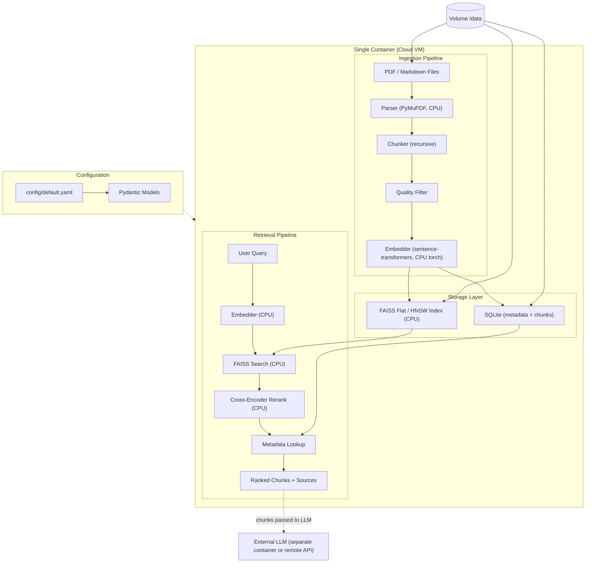
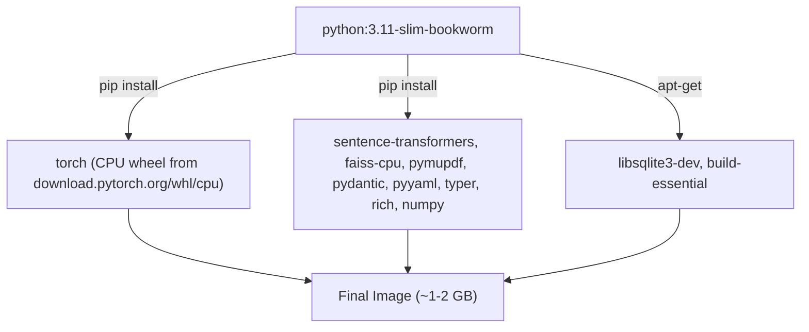

# RAG System Architecture (CPU-only)

A CPU-only document ingestion and retrieval system designed to run in a modest cloud VM. This is the `cpu-only` branch fork of the DGX Spark GPU version on `main`.

## Scope

This system handles **document ingestion** (parse, chunk, embed, index) and **retrieval** (embed query, search, return ranked chunks with metadata). LLM generation is explicitly **out of scope** -- it happens in a separate container (e.g. vLLM, Ollama) or via remote API calls. This system's output is a set of retrieved chunks with scores and source metadata, ready to be passed to any LLM.

## Target Platform: Cloud VM

The system runs inside a single container on a general-purpose cloud VM with **no GPU required**.

| Spec | Minimum | Recommended |
|------|---------|-------------|
| CPU | 4 vCPU (x86_64 or arm64) | 8 vCPU |
| Memory | 8 GB | 16 GB |
| Storage | 20 GB | 50 GB (NVMe) |
| OS | Linux with Docker | Linux with Docker |
| Python | 3.11+ (via container) | 3.11+ (via container) |

No CUDA drivers, no NVIDIA Container Toolkit, no `--gpus all` needed.

### Performance expectations

On an 8 vCPU VM with the default `nomic-embed-text-v1.5` (137M params, 768-dim):

| Operation | Throughput / latency |
|-----------|----------------------|
| Embedding (ingest) | ~50-200 chunks/s |
| Query embedding | ~50-150 ms |
| FAISS flat search | <50 ms for up to ~500k chunks |
| Cross-encoder rerank (20 candidates) | ~200-500 ms |

For larger corpora (>500k chunks) switch `retriever.algorithm` from `flat` to `hnsw`.

## Architecture Overview



## Component Selection

### Document Parsing -- PyMuPDF

[PyMuPDF](https://pymupdf.readthedocs.io/) (fitz) for fast CPU text extraction from PDFs. Markdown files parsed natively.

### Embeddings -- sentence-transformers (CPU torch)

[sentence-transformers](https://github.com/huggingface/sentence-transformers) on top of CPU PyTorch. 15,000+ pre-trained models on HuggingFace. The container installs the official `torch` wheel from `https://download.pytorch.org/whl/cpu`, which has no CUDA runtime.

### Embedding Model Tradeoffs

The default is `nomic-ai/nomic-embed-text-v1.5` -- same model as the GPU branch, so retrieval quality is unchanged. On CPU, smaller / lower-dim models are significantly faster if quality can be traded off:

| Model | Params | Dims | MTEB | License | CPU notes |
|-------|--------|------|------|---------|-----------|
| all-MiniLM-L6-v2 | 22M | 384 | 56.3 | Apache 2.0 | Fastest, lowest quality |
| bge-small-en-v1.5 | 33M | 384 | 62.2 | MIT | Great speed/quality tradeoff |
| nomic-embed-text-v1.5 | 137M | 768 | ~62 | Apache 2.0 | **Default.** 8k context, Matryoshka |
| bge-base-en-v1.5 | 109M | 768 | 63.6 | MIT | Comparable to nomic |

Swap by editing `embedder.model` in `config/default.yaml`; no code changes needed.

### Vector Search -- FAISS (CPU)

[FAISS](https://github.com/facebookresearch/faiss) (Meta) via `faiss-cpu`. Runs in-process, no separate server.

Two backends are available:

| `retriever.backend` | `retriever.algorithm` | FAISS index | When to use |
|---------------------|-----------------------|-------------|-------------|
| `faiss` (default) | `flat` | `IndexFlatIP` / `IndexFlatL2` | Exact search, works great up to ~500k vectors |
| `faiss` | `hnsw` | `IndexHNSWFlat` | Approximate but fast for millions of vectors |
| `numpy` | (ignored) | (none, brute force) | Minimal fallback, no FAISS dep, tiny corpora |


### Reranker -- Cross-Encoder (CPU)

[cross-encoder/ms-marco-MiniLM-L-6-v2](https://huggingface.co/cross-encoder/ms-marco-MiniLM-L-6-v2) (22M params) runs on CPU torch. Applied only to a small candidate set (top 20-40 from FAISS) so total rerank latency stays under ~500 ms.

### Config Management -- YAML + Pydantic

All behavior (model names, chunk sizes, retriever backend, retrieval params) lives in YAML config validated by Pydantic models. Zero code changes needed to switch models or parameters.

## Storage Layer Portability

The on-disk storage format is intentionally compatible with the GPU (`main`) branch so indexes can be shared or migrated without re-embedding:

| Artifact | Portable across branches? | Notes |
|----------|---------------------------|-------|
| `metadata.db` (SQLite) | Yes | Schema is backend-agnostic |
| `vectors.npy` | Yes | Raw float32 embedding matrix |
| `id_map.npy` | Yes | Row-index to chunk-id mapping |
| `faiss.index` | CPU branch only | Rebuilt from `vectors.npy` if missing |
| `cagra.index` | GPU branch only | Ignored on CPU branch |

When the CPU branch loads an index directory that contains `vectors.npy` but no `faiss.index`, it rebuilds the FAISS index in memory on `build_index()`. This means you can copy `/data` from a GPU machine to a CPU VM and start serving immediately with no re-embedding.

## Container Image Strategy



Why `python:3.11-slim-bookworm`:
- Tiny base (~150 MB) vs multi-GB NGC PyTorch
- No CUDA libraries shipped, so the final image is cloud-VM-sized
- Works on both x86_64 and arm64 hosts without modification

## Project Structure

```
rag_system/
|-- system_architecture.md        # This document
|-- config/
|   `-- default.yaml              # All pipeline settings
|-- src/
|   |-- __init__.py
|   |-- config.py                 # Pydantic config models
|   |-- parsers/
|   |   |-- base.py
|   |   |-- pdf_parser.py         # PyMuPDF
|   |   `-- markdown_parser.py
|   |-- chunkers/
|   |   |-- base.py
|   |   |-- recursive.py
|   |   `-- quality_filter.py
|   |-- embedders/
|   |   |-- base.py
|   |   |-- local.py              # sentence-transformers (CPU)
|   |   `-- api.py                # OpenAI-compatible API
|   |-- rerankers/
|   |   |-- base.py
|   |   `-- cross_encoder.py      # CPU cross-encoder
|   |-- retrievers/
|   |   |-- base.py
|   |   |-- faiss_retriever.py    # faiss-cpu IndexFlatIP / HNSW
|   |   |-- numpy_retriever.py    # Brute-force fallback
|   |   `-- metadata_store.py     # SQLite metadata/chunk store
|   |-- pipeline.py               # Orchestrates ingest + retrieve
|   `-- viewer.py                 # Chunk viewer / semantic search UI
|-- cli.py                        # CLI entry point (ingest / retrieve / view)
|-- Dockerfile                    # python:3.11-slim + CPU torch + faiss-cpu
|-- pyproject.toml
|-- .env.example
`-- README.md
```

## Configuration Reference

All behavior is controlled by `config/default.yaml`:

```yaml
parser:
  pdf_backend: "pymupdf"

chunker:
  strategy: "recursive"
  chunk_size: 2048
  chunk_overlap: 256

quality_filter:
  enabled: true
  min_quality_score: 0.3
  skip_references: true
  max_url_ratio: 0.5

embedder:
  provider: "local"                    # "local" | "openai"
  model: "nomic-ai/nomic-embed-text-v1.5"
  device: "cpu"                        # "cpu" | "auto"
  dimensions: 768
  batch_size: 32

reranker:
  enabled: true
  model: "cross-encoder/ms-marco-MiniLM-L-6-v2"
  device: "cpu"                        # "cpu" | "auto"

retriever:
  backend: "faiss"                     # "faiss" | "numpy"
  algorithm: "flat"                    # "flat" | "hnsw"
  metric: "cosine"
  top_k: 5
  min_chunk_length: 128
  index_path: "/data/indexes"
  metadata_db: "/data/metadata.db"
```

## Build and Run

```bash
# Build the container
docker build -t rag-system-cpu .

# Ingest documents
docker run --rm \
  -v ./data:/data \
  -v ./config:/app/config \
  rag-system-cpu ingest /data/docs/

# Retrieve chunks for a query
docker run --rm \
  -v ./data:/data \
  -v ./config:/app/config \
  rag-system-cpu retrieve "What is the main finding?"

# Launch the chunk viewer
docker run --rm -p 8501:8501 \
  -v ./data:/data \
  -v ./config:/app/config \
  rag-system-cpu view
```
